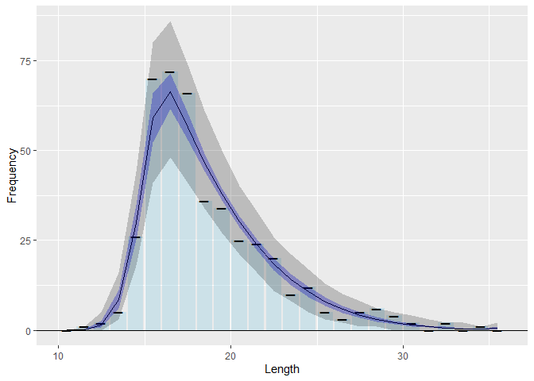

<!-- README.md is generated from README.Rmd. Please edit that file -->

# fishblicc

<!-- badges: start -->
<!-- badges: end -->

The goal of fishblicc is to provide tools to fit a catch curve model to
individual length frequency samples, analogous to an age-based catch
curve. However, the model can account for length-based selectivity and
multiple gears. The model is fitted using MCMC in Stan (mc-stan.org) to
account for uncertainty. The approach could be useful for data-limited
stock assessments, such as assessing stock status at end of projects
where length data have been collected, or continuous monitoring of
low-data bycatch species as part of a harvest strategy. The model also
provides tools to assess how effective length sampling is in estimating
quantities of interest.

## Installation

You can install the development version of fishblicc like so:

``` r
if (require("remotes")) install.packages("remotes")
install_github("PaulAHMedley/fishblicc")
```

## Model Description

This is the Bayesian Length Interval Catch Curve project to estimate
mortality from length frequency samples that form a snapshot of a
fishery. Length samples are not treated as a time series. This is
explicitly a “data-limited” method designed to be used as a risk
assessment approach rather than provide definitive information on stock
status. Although the model does not require a data time series, it
assumes the data are a snapshot of the catch length composition from a
fishery in a stationary state. It is suitable for end-of-project
evaluation of length frequency data that may have been collected over a
short time period (e.g. a year) or to monitor status of many species
that may take up a small proportion of the catches.  
The assessment is carried out in R using Stan (mc-stan.org) to carry out
the MCMC.

In common with other such methods, there are significant assumptions
that will not be met in practice, therefore the focus of this method is
robustness and looking for ways to reduce the impact of model structural
errors or at least spot when such errors may invalidate the results.

The method can be used to evaluate stock status based on the spawning
potential ratio. In general, this uses the ratio of large (older,
mature) fish in a sample compared to small (immature young) fish. If the
ratio is too small compared to what might be expected in a sample of a
population that is unfished, the population will be at high risk of
overexploitation.

The model used here does not convert length to age, but instead accounts
for mortality as fish grow through length intervals. The estimation
method works by assuming that the von Bertalanffy growth model describes
the length at age and variation in individual fish growth is governed by
their maximum length which is drawn from a gamma probability density
function (constant CV). The model is flexible enough to include all
data, so, for example, observed lengths above $L_\infty$ are not
rejected.

The model fits the following 8 parameters: - Linf the asymptotic mean
length  
- Galpha the growth model inverse error parameter ( $CV = Galpha^{-0.5}$
)  
- Mk the natural mortality in time units of K, the growth rate  
- Fk a scale parameter for the fishing mortality in time units of K, the
growth rate  
- Smx the maximum point for the double-sided normal selectivity model  
- Ss1 the lower-side slope parameter for the double-sided normal
selectivity model (i.e. 1/variance)  
- Ss2 the upper-side slope parameter for the double-sided normal
selectivity model (equal to zero for a flat-topped selectivity.  
- phi the over-dispersion parameter of the counts in the length bins for
the negative binomial.

The length catch curve is used to estimate the spawning potential ratio.
To do this, estimates of natural mortality, length-weight and maturity
are required. These cannot be estimated from a length frequency, so have
to be provided as priors from other sources. Being data-limited, only
the length-weight exponent parameter (b) and the logistic maturity at
length model parameters (length at 50% maturity and logistic steepness)
are required. The natural mortality is then inferred relying on life
history invariants as suggested by Prince et al. Hordyk et al. (2015?).
The additional parameters are: - $L_m$ and $L_s$ for the maturity at 50%
and maturity steepness for a logistic maturity curve.  
- $b$ parameter for the length weight relationship $W=aL^b$

## Example

In this basic example, there is a single representative sample of
lengths from a single gear fishery. The objective is to estimate a
simple selectivity based on the double-sided normal function as well as
determine the stock status. Because this is data limited, it is also
valuable to estimate the uncertainty and evaluative how reliable the
result is.

The analysis consists of fitting the model to the data, determining the
spawning potential ratio reference points, and then the expected catch,
selectivity and so on by length. (Note that because the fit uses MCMC,
estimation take some time.)

``` r
library("fishblicc")
## Prepare some data in the required format
ld <- blicc_dat(LLB = 10:35,          # Lower boundaries of each length bin
          fq=c(0,1,2,5,26,70,72,66,36,34,25,24,20,
               10,12,5,3,5,6,4,2,0,2,0,1,0),    # Corresponding frequency data
          a=1.0e-4,       # Length-weight scale parameter (optional)
          b=2.95,         # Length-weight exponent
          L50=24,         # Length at 50% maturity
          Linf=c(32, 3))  # Maximum mean length normal priors
## Fit the model to these data with default settings
slim <- blicc_fit(ld)
><> Chain 1: Initial log joint probability = -306.169
><> Chain 1:     Iter      log prob        ||dx||      ||grad||       alpha      alpha0  # evals  Notes 
><> Chain 1: Exception: neg_binomial_2_lpmf: Location parameter[1] is nan, but must be positive finite! (in 'string', line 328, column 4 to column 52)
><> Exception: neg_binomial_2_lpmf: Location parameter[1] is nan, but must be positive finite! (in 'string', line 328, column 4 to column 52)
><> Exception: neg_binomial_2_lpmf: Location parameter[1] is nan, but must be positive finite! (in 'string', line 328, column 4 to column 52)
><> 
><> Chain 1: Exception: neg_binomial_2_lpmf: Location parameter[1] is nan, but must be positive finite! (in 'string', line 328, column 4 to column 52)
><> Exception: neg_binomial_2_lpmf: Location parameter[1] is nan, but must be positive finite! (in 'string', line 328, column 4 to column 52)
><> 
><> Chain 1:      394      -66.4741   1.95901e-05    0.00785845      0.7942     0.07942      524   
><> Chain 1: Optimization terminated normally: 
><> Chain 1:   Convergence detected: relative gradient magnitude is below tolerance
## Calculate reference points - this takes some time
rp_df <- blicc_ref_pts(slim, ld)
## Get the model expected values by length
lx_df <- blicc_expect_len(rp_df, ld)
><> Warning: Dropping 'draws_df' class as required metadata was removed.
## Because the calculation takes a little time, it is best to save the results
save(ld, slim, rp_df, lx_df, file="fishblicc_analysis.rda") 
```

This produces the following objects:  
- “ld” is the data file containing the length frequency and information
for priors used in the fit.  
- “slim” is a stanfit object and there are useful tools in the package
rstan which will allow you to examine the fit. However, rstan will
require that Rtools has also been installed on Windows or Mac OS because
it requires access to a C++ compiler.  
- “rp_df” is a draws object that can be used by the packages posterior
and bayesplot to examine results.  
- “lx_df” is a tibble (data frame) that provides expected values by
length, such as the length frequency and selectivity.

The fit results can be summarised in table form.

``` r
## Summarise the results
summary(rp_df)
><> # A tibble: 18 × 10
><>    variable      mean   median       sd      mad       q5      q95  rhat ess_b…¹
><>    <chr>        <dbl>    <dbl>    <dbl>    <dbl>    <dbl>    <dbl> <dbl>   <dbl>
><>  1 Linf      34.5      3.45e+1  2.09     2.10     3.12e+1  38.2     1.00   1163.
><>  2 Galpha    97.0      9.39e+1 24.9     23.4      6.25e+1 142.      1.00   1833.
><>  3 Mk         0.983    9.77e-1  0.0985   0.0974   8.30e-1   1.15    1.00   1903.
><>  4 Fk         2.86     2.82e+0  0.666    0.688    1.83e+0   3.99    1.01   1044.
><>  5 Smx       16.5      1.65e+1  0.347    0.327    1.60e+1  17.1     1.01   1043.
><>  6 Ss1        0.265    2.55e-1  0.0689   0.0614   1.71e-1   0.389   1.00   1142.
><>  7 Ss2        0.00448  3.78e-3  0.00338  0.00355  3.01e-4   0.0108  1.00    886.
><>  8 NB_phi   116.       1.04e+2 60.2     46.3      4.75e+1 222.      1.00   1829.
><>  9 Gbeta      2.81     2.74e+0  0.717    0.666    1.82e+0   4.08    1.00   1846.
><> 10 SPR        0.0785   5.66e-2  0.0662   0.0408   1.96e-2   0.204   1.00   1087.
><> 11 lp__     -68.2     -6.79e+1  2.05     1.87    -7.22e+1 -65.5     1.00    901.
><> 12 F20        1.57     1.48e+0  0.404    0.362    1.10e+0   2.37    1.00   1294.
><> 13 F30        1.14     1.07e+0  0.308    0.279    7.86e-1   1.75    1.00   1257.
><> 14 F40        0.852    8.00e-1  0.237    0.219    5.77e-1   1.32    1.00   1236.
><> 15 F01        1.36     1.27e+0  0.437    0.428    8.30e-1   2.20    1.00   1134.
><> 16 S20       NA       NA       NA       NA       NA        NA      NA        NA 
><> 17 S40       NA       NA       NA       NA       NA        NA      NA        NA 
><> 18 SMY       25.1      2.50e+1  1.91     1.92     2.20e+1  28.4     1.00   1200.
><> # … with 1 more variable: ess_tail <dbl>, and abbreviated variable name
><> #   ¹​ess_bulk
```

There are a number of specialised plotting functions specific to length
frequency and yield-per-recruit analysis for convenience. This is a plot
showing the observed and expected length frequency, with 80% credible
interval for the observations (including the expected variation in the
data).

``` r
plot_expected_frequency(rp_df, lx_df, ld) #Plot the results to check the model fit
><> Warning: Dropping 'draws_df' class as required metadata was removed.
```


