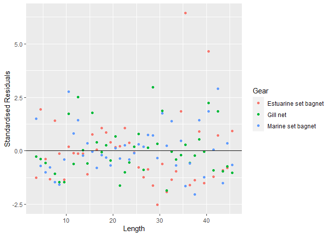
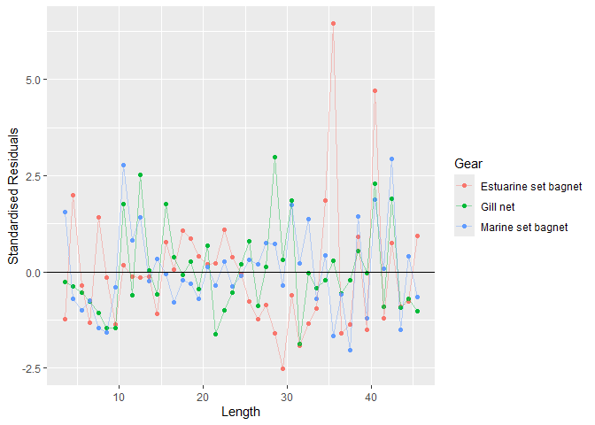
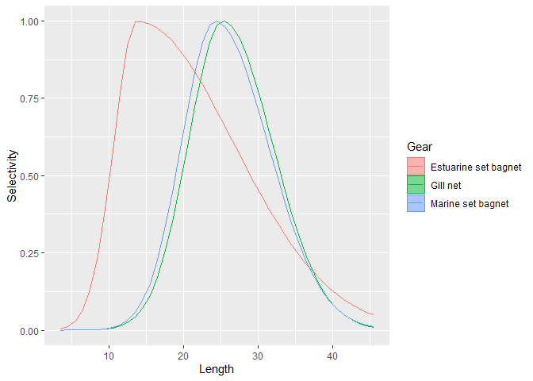

<!-- README.md is generated from README.Rmd. Please edit that file -->

# fishblicc

<!-- badges: start -->
<!-- badges: end -->

`fishblicc` provides tools to fit a catch curve model to individual
length frequency samples, analogous to an age-based catch curve.
However, the model accounts for different length-based selectivities and
multiple gears. The model is fitted using MCMC in Stan (mc-stan.org).
The approach could be useful for data-limited stock assessments, such as
assessing stock status at end of projects where length data have been
collected, or continuous monitoring of low-data bycatch species as part
of a harvest strategy. The model also provides tools to assess how
effective length sampling is in estimating quantities of interest.

## Installation

You will also need to have Rtools installed so that the model can
compile.

For Windows, Rtools can be downloaded from
“<https://cran.r-project.org/bin/windows/Rtools/>”

Note that for versions of R and RTools 4.2 and 4.3 you will need to
manually install `rstan` as follows:

``` r
install.packages("StanHeaders", repos = c("https://mc-stan.org/r-packages/", getOption("repos")))
install.packages("rstan", repos = c("https://mc-stan.org/r-packages/", getOption("repos")))
```

This is the preview of rstan 2.26 that will presumably eventually become
available on CRAN so that this step will be obsolete (see
<https://github.com/stan-dev/rstan/wiki/Configuring-C---Toolchain-for-Windows>).

You can install the development version of fishblicc:

``` r
if (! require("remotes")) install.packages("remotes")
remotes::install_github("PaulAHMedley/fishblicc")
```

## Model Description

This is the Bayesian Length Interval Catch Curve to estimate mortality
from length frequency samples that form a snapshot of a fishery. This is
explicitly a “data-limited” method designed to be used as a risk
assessment approach rather than provide definitive information on stock
status. The model does not require a data time series, but it assumes
that the data are a snapshot of the catch length composition from a
fishery in a stationary state. The model can account for multiple gears
with different selectivities and has a flexible approach to estimating
selectivity, including dome-shaped functions and functions with multiple
modes. It is suitable for end-of-project evaluation of length frequency
data that may have been collected over a short time period (e.g. a year)
or to monitor status of many species that may take up a small proportion
of the catches.

The method is implemented in R using Stan (mc-stan.org) to carry out the
MCMC.

In common with other such methods, there are significant assumptions
that will not be met in practice, therefore the focus is robustness,
trying to account for full uncertainty and looking for ways to reduce
the impact of model structural errors or at least spot when such errors
may invalidate the results. This is done through a flexible model
structure that can account for alternative models for
mortality-at-length as well as alternative life history parameters and
can be used in a range of sensitivity analyses.

The method can be used to evaluate stock status based on the spawning
potential ratio (SPR). In general, this uses the ratio of large (older,
mature) fish in a sample compared to small (immature young) fish. If the
ratio is small compared to what might be expected in a sample from an
unfished population, the population will be at high risk of
overexploitation.

The model used here does not convert length to age, but instead accounts
for mortality as fish grow through length intervals. The estimation
method works by assuming that the von Bertalanffy growth model describes
the mean length at age and variation in individual fish growth is
governed by their individual maximum length which is drawn from a gamma
probability density function (with constant CV). The model is flexible
enough to include all data, so, for example, observed lengths above
$L_\infty$ are not rejected. The model allows for the application of
piece-wise mortality across length bins, so changing
mortality-at-length, such as that due to gear selectivity or decreasing
natural mortality with length, can be accommodated.

The model fits the following parameters: - Linf the asymptotic mean
length  
- Galpha the growth model inverse error parameter ( $CV = Galpha^{-0.5}$
)  
- Mk the natural mortality in time units of K (growth rate)  
- Fk the fishing mortality in time units of K (growth rate), one for
each fishing gear contributing to fishing mortality  
- Sm All selectivity function parameters in a single vector, including
length location parameters and slope parameters for each parametric
selectivity function.  
- phi the over-dispersion parameter of the counts in the length bins for
the negative binomial.

The following additional fixed parameters are required to calculate the
SPR: - $L_m$ (and $L_s$) for the maturity at 50% (and steepness) for a
logistic maturity curve.  
- $b$ parameter for the length weight relationship $W=aL^b$ .

The length interval catch curve is used to estimate the spawning
potential ratio. To do this, estimates of natural mortality,
length-weight and maturity are required. These generally cannot all be
estimated independently from length frequency data, so informative
priors from other sources are required. Being data-limited, there are
minimum information requirements where defaults can be used if
information is not available.

## Example

In this basic example, there is a single representative sample of
lengths from a three gear fishery. The objective is to estimate the
selectivities based on the double-sided normal function as well as
determine the stock status. Because this is data limited, it is also
valuable to estimate the uncertainty and evaluative how reliable the
result is. In a real assessment, multiple configurations with different
priors and selectivity functions would be tested.

The analysis consists of fitting the model to the data, determining the
spawning potential ratio reference points, and then the expected catch,
selectivity and so on by length. (Note that if the fit used the MCMC
facility, estimation would take much more time. The more-rapid maximum
posterior density estimation is used here.)

These data are taken from a bombay duck (*Harpadon nehereus*) fishery,
where bombay duck are caught predominantly in three artisanal gears.
(Note that this is an example only - the analysis is incomplete as trawl
catches are missing from these data).

``` r
library("fishblicc")
## Prepare some data in the required format
dl <- blicc_dat(
  model_name = "Base: Mk ~ Length-inverse",
  LLB = 3:45,                       # Lower boundaries of length bins
  fq = list(`Estuarine Set bagnet`= c(2,19,19,25,95,106,105,220,246,268,266,185,274,
                                      213,240,206,165,137,119,122,88,65,43,29,27,15,5,
                                      15,5,6,6,14,25,1,1,5,0,9,0,2,0,0,3),
            `Gill net` = c(0,0,0,0,0,0,1,14,11,42,38,49,125,133,160,222,226,341,195,
                           251,283,318,322,183,203,282,142,154,42,62,42,33,28,15,12,
                           11,6,9,1,4,0,0,0),
            `Marine set bagnet` = c(1,0,0,1,1,3,14,54,63,118,130,228,303,344,532,649,
                                    692,954,895,1032,828,793,755,621,581,472,295,362,
                                    208,203,94,95,35,38,13,33,9,18,7,11,0,2,2)), # frequency data
  Linf = c(40, 2),
  sel_fun = c("dsnormal", "dsnormal", "dsnormal"),  # Selectivity functions
  Catch = c(0.1802070, 0.2101353, 0.6096577),          # Relative catch for each gear
  gear_names = c("Estuarine set bagnet", "Gill net", "Marine set bagnet"),
  Mk = 2.135019,          # Natural mortality prior mean (at reference length)
  ref_length = 21.93152,  # Reference length for the length-inverse natural mortality model
  a = 0.004721956,        # Length-weight scale parameter (optional)
  b = 3.146168,           # Length-weight exponent
  L50 = 23.2335           # Length at 50% maturity
)

## Fit the model to these data 
slim <- blicc_mpd(dl)
><> Chain 1: Initial log joint probability = -9882.98
><> Chain 1:     Iter      log prob        ||dx||      ||grad||       alpha      alpha0  # evals  Notes 
><> Chain 1: Exception: neg_binomial_2_lpmf: Location parameter[1] is nan, but must be positive finite! (in 'string', line 263, column 6 to column 59)
><> Exception: neg_binomial_2_lpmf: Location parameter[1] is nan, but must be positive finite! (in 'string', line 263, column 6 to column 59)
><> Exception: neg_binomial_2_lpmf: Location parameter[1] is nan, but must be positive finite! (in 'string', line 263, column 6 to column 59)
><> 
><> Chain 1:      499        -533.7   0.000349046         3.442      0.8663      0.8663      548   
><> Chain 1:     Iter      log prob        ||dx||      ||grad||       alpha      alpha0  # evals  Notes 
><> Chain 1:      999      -533.641   1.97407e-05     0.0725687      0.8664      0.8664     1108   
><> Chain 1:     Iter      log prob        ||dx||      ||grad||       alpha      alpha0  # evals  Notes 
><> Chain 1:     1259      -533.641   2.41556e-06     0.0429371      0.4703           1     1390   
><> Chain 1: Optimization terminated normally: 
><> Chain 1:   Convergence detected: relative gradient magnitude is below tolerance
## "slim <- blicc_fit(ld)" to run the full MCMC, but this takes a little time to run.
## Calculate reference points and expected values etc.
rp_res <- blicc_ref_pts(slim, dl)
## If estimating by MCMC, the calculation also takes a little time, so it is often best to save the results
## save(slim, rp_res, file="fishblicc_example.rda") 
```

This produces the following objects:  
- “dl” is the data file containing the length frequency and information
for priors used in the fit.  
- “slim” is a stanfit object and there are useful tools in the package
rstan which will allow you to examine the fit.  
- “rp_res” is a list containing the data object used to create it, and
two draws objects, `rp_df` for parameters and reference points and
`lx_df` for expected length frequencies, that can be used by the
packages `posterior` and `bayesplot` to examine results, and a vector
`vdir` giving the ‘direction’ of search for reference points only
relevant if there is more than one gear (see documentation).

The priors used by the model can be inspected and produced as a table.

``` r
blicc_priors(dl) 
><> # A tibble: 20 × 6
><>    Gear                 Parameter `Function Type`     Mean     Mu    SD
><>    <chr>                <chr>     <chr>              <dbl>  <dbl> <dbl>
><>  1 <NA>                 Linf      Normal           40      40      2   
><>  2 <NA>                 Galpha    Lognormal       100       4.61   0.25
><>  3 <NA>                 Mk        Lognormal         2.14    0.758  0.1 
><>  4 <NA>                 <NA>      Ref. length      21.9    NA     NA   
><>  5 Estuarine set bagnet Fk        Lognormal         0.385  -0.955  2   
><>  6 Gill net             Fk        Lognormal         0.449  -0.802  2   
><>  7 Marine set bagnet    Fk        Lognormal         1.30    0.264  2   
><>  8 Estuarine set bagnet Mode      Lognormal        13.5     2.60   1.5 
><>  9 <NA>                 Left SD   <NA>              0.132  -2.02   1.5 
><> 10 <NA>                 Right SD  <NA>              0.0147 -4.22   1.5 
><> 11 Gill net             Mode      Lognormal        21.5     3.07   1.5 
><> 12 <NA>                 Left SD   <NA>              0.198  -1.62   1.5 
><> 13 <NA>                 Right SD  <NA>              0.0166 -4.10   1.5 
><> 14 Marine set bagnet    Mode      Lognormal        20.5     3.02   1.5 
><> 15 <NA>                 Left SD   <NA>              0.132  -2.02   1.5 
><> 16 <NA>                 Right SD  <NA>              0.0147 -4.22   1.5 
><> 17 <NA>                 NB_phi    Lognormal       100       4.61   0.5 
><> 18 <NA>                 b         <NA>              3.15    3.15  NA   
><> 19 <NA>                 L50       <NA>             23.2    23.2   NA   
><> 20 <NA>                 Ls        <NA>              3.51    3.51  NA
```

The fit results can be inspected.

``` r
blicc_results(slim)
><> # A tibble: 19 × 3
><>    Parameter `Max. Posterior`        SE
><>    <chr>                <dbl>     <dbl>
><>  1 Linf              42.2      1.39    
><>  2 Galpha            97.3     25.0     
><>  3 Mk                 2.02     0.206   
><>  4 Fk[1]              0.120    0.0234  
><>  5 Fk[2]              0.400    0.0926  
><>  6 Fk[3]              1.06     0.231   
><>  7 Sm[1]             13.7      0.568   
><>  8 Sm[2]              0.0523   0.00729 
><>  9 Sm[3]              0.00289  0.000713
><> 10 Sm[4]             25.2      0.781   
><> 11 Sm[5]              0.0232   0.00249 
><> 12 Sm[6]              0.0111   0.00182 
><> 13 Sm[7]             24.2      0.657   
><> 14 Sm[8]              0.0250   0.00218 
><> 15 Sm[9]              0.00979  0.00136 
><> 16 NB_phi            17.8      3.95    
><> 17 Gbeta              2.30     0.569   
><> 18 SPR                0.336    0.0780  
><> 19 lp__            -534.      NA
```

There are a number of specialised plotting functions specific to length
frequency and yield-per-recruit analysis for convenience. This is a plot
showing the observed and expected length frequency, with 80% credible
interval for the observations (including the expected variation in the
data).

``` r
plot_expected_frequency(rp_res, gear=1:3) #Plot the results to check the model fit
```

<div class="figure">


<p class="caption">
Figure: Expected frequency
</p>

</div>

``` r
plot_residuals(rp_res) 
```

<div class="figure">


<p class="caption">
Figure: Residuals
</p>

</div>

The set bagnet shows clear dome-shape, whereas the gill net continues to
catch some larger fish, so this pattern is less clear. The Trawl survey
is a logistic selectivity.

``` r
plot_selectivity(rp_res)
```

<div class="figure">


<p class="caption">
Figure: Fitted selectivities
</p>

</div>
