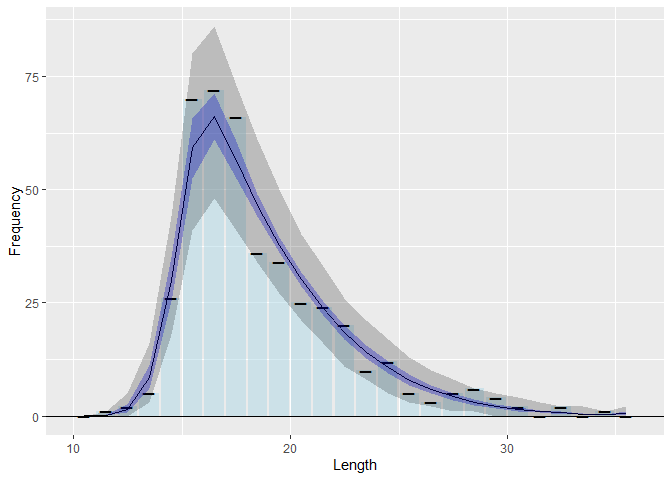

<!-- README.md is generated from README.Rmd. Please edit that file -->

# fishblicc

<!-- badges: start -->
<!-- badges: end -->

The goal of fishblicc is to provide tools to fit a catch curve model to
individual length frequency samples, analogous to an age-based catch
curve. However, the model can account for length-based selectivity and
multiple gears. The model is fitted using MCMC in Stan (mc-stan.org) to
account for uncertainty. The approach could be useful for data-limited
stock assessments, such as assessing stock status at end of projects
where length data have been collected, or continuous monitoring of
low-data bycatch species as part of a harvest strategy. The model also
provides tools to assess how effective length sampling is in estimating
quantities of interest.

## Installation

You can install the development version of fishblicc like so:

``` r
if (require("remotes")) install.packages("remotes")
install_github("PaulAHMedley/fishblicc")
```

## Model Description

This is the Bayesian Length Interval Catch Curve project to estimate
mortality from length frequency samples that form a snapshot of a
fishery. Length samples are not treated as a time series. This is
explicitly a “data-limited” method designed to be used as a risk
assessment approach rather than provide definitive information on stock
status. Although the model does not require a data time series, it
assumes the data are a snapshot of the catch length composition from a
fishery in a stationary state. It is suitable for end-of-project
evaluation of length frequency data that may have been collected over a
short time period (e.g. a year) or to monitor status of many species
that may take up a small proportion of the catches.  
The assessment is carried out in R using Stan (mc-stan.org) to carry out
the MCMC.

In common with other such methods, there are significant assumptions
that will not be met in practice, therefore the focus of this method is
robustness and looking for ways to reduce the impact of model structural
errors or at least spot when such errors may invalidate the results.

The method can be used to evaluate stock status based on the spawning
potential ratio. In general, this uses the ratio of large (older,
mature) fish in a sample compared to small (immature young) fish. If the
ratio is too small compared to what might be expected in a sample of a
population that is unfished, the population will be at high risk of
overexploitation.

The model used here does not convert length to age, but instead accounts
for mortality as fish grow through length intervals. The estimation
method works by assuming that the von Bertalanffy growth model describes
the length at age and variation in individual fish growth is governed by
their maximum length which is drawn from a gamma probability density
function (constant CV). The model is flexible enough to include all
data, so, for example, observed lengths above $L_\infty$ are not
rejected.

The model fits the following 8 parameters: - Linf the asymptotic mean
length  
- Galpha the growth model inverse error parameter
($CV = Galpha^{-0.5}$) - Mk the natural mortality in time units of K,
the growth rate  
- Fk a scale parameter for the fishing mortality in time units of K, the
growth rate  
- Smx the maximum point for the double-sided normal selectivity model -
Ss1 the lower-side slope parameter for the double-sided normal
selectivity model (i.e. 1/variance) - Ss2 the upper-side slope parameter
for the double-sided normal selectivity model (equal to zero for a
flat-topped selectivity. - phi the over-dispersion parameter of the
counts in the length bins for the negative binomial.

The length catch curve is used to estimate the spawning potential ratio.
To do this, estimates of natural mortality, length-weight and maturity
are required. These cannot be estimated from a length frequency, so have
to be provided as priors from other sources. Being data-limited, only
the length-weight exponent parameter (b) and the logistic maturity at
length model parameters (length at 50% maturity and logistic steepness)
are required. The natural mortality is then inferred relying on life
history invariants as suggested by Prince et al. Hordyk et al. (2015?).
The additional parameters are: - $L_m$ and $L_s$ for the maturity at 50%
and maturity steepness for a logistic maturity curve.  
- $b$ parameter for the length weight relationship $W=aL^b$

## Example

This is a basic example which shows you how to solve a common problem:

``` r
library("fishblicc")
## Prepare some data in the required format
<<<<<<< HEAD
ld <- blicc_dat(LLB = 10:35,          # Lower boundaries of each length bin
=======
eg_ld <- blicc_dat(LLB = 10:35,          # Lower boundaries of each length bin
>>>>>>> 75ac5e9f2ad2dfbc56b0c95030bffd74ae792f5b
          fq=c(0,1,2,5,26,70,72,66,36,34,25,24,20,
               10,12,5,3,5,6,4,2,0,2,0,1,0),    # Corresponding frequency data
          a=1.0e-4,       # Length-weight scale parameter (optional)
          b=2.95,         # Length-weight exponent
          L50=24,         # Length at 50% maturity
          Linf=c(32, 3))  # Maximum mean length normal priors
## Fit the model to these data with default settings
slim <- blicc_fit(ld)
<<<<<<< HEAD
><> Chain 1: Initial log joint probability = -1481.35
><> Chain 1:     Iter      log prob        ||dx||      ||grad||       alpha      alpha0  # evals  Notes 
><> Chain 1: Exception: neg_binomial_2_lpmf: Location parameter[1] is nan, but must be positive finite! (in 'string', line 328, column 4 to column 52)
><> Exception: neg_binomial_2_lpmf: Location parameter[1] is nan, but must be positive finite! (in 'string', line 328, column 4 to column 52)
><> 
><> Chain 1:      322      -66.4741   1.27638e-05    0.00269604      0.8401      0.8401      424   
><> Chain 1: Optimization terminated normally: 
><> Chain 1:   Convergence detected: relative gradient magnitude is below tolerance
><> 
><> SAMPLING FOR MODEL 'BLICC' NOW (CHAIN 1).
><> Chain 1: 
><> Chain 1: Gradient evaluation took 0.003925 seconds
><> Chain 1: 1000 transitions using 10 leapfrog steps per transition would take 39.25 seconds.
><> Chain 1: Adjust your expectations accordingly!
><> Chain 1: 
><> Chain 1: 
><> Chain 1: Iteration:    1 / 1500 [  0%]  (Warmup)
><> Chain 1: Iteration:  150 / 1500 [ 10%]  (Warmup)
><> Chain 1: Iteration:  300 / 1500 [ 20%]  (Warmup)
><> Chain 1: Iteration:  450 / 1500 [ 30%]  (Warmup)
><> Chain 1: Iteration:  600 / 1500 [ 40%]  (Warmup)
><> Chain 1: Iteration:  750 / 1500 [ 50%]  (Warmup)
><> Chain 1: Iteration:  900 / 1500 [ 60%]  (Warmup)
><> Chain 1: Iteration: 1001 / 1500 [ 66%]  (Sampling)
><> Chain 1: Iteration: 1150 / 1500 [ 76%]  (Sampling)
><> Chain 1: Iteration: 1300 / 1500 [ 86%]  (Sampling)
><> Chain 1: Iteration: 1450 / 1500 [ 96%]  (Sampling)
><> Chain 1: Iteration: 1500 / 1500 [100%]  (Sampling)
><> Chain 1: 
><> Chain 1:  Elapsed Time: 210.559 seconds (Warm-up)
><> Chain 1:                35.352 seconds (Sampling)
><> Chain 1:                245.911 seconds (Total)
><> Chain 1: 
><> 
><> SAMPLING FOR MODEL 'BLICC' NOW (CHAIN 2).
><> Chain 2: 
><> Chain 2: Gradient evaluation took 0.003716 seconds
><> Chain 2: 1000 transitions using 10 leapfrog steps per transition would take 37.16 seconds.
><> Chain 2: Adjust your expectations accordingly!
><> Chain 2: 
><> Chain 2: 
><> Chain 2: Iteration:    1 / 1500 [  0%]  (Warmup)
><> Chain 2: Iteration:  150 / 1500 [ 10%]  (Warmup)
><> Chain 2: Iteration:  300 / 1500 [ 20%]  (Warmup)
><> Chain 2: Iteration:  450 / 1500 [ 30%]  (Warmup)
><> Chain 2: Iteration:  600 / 1500 [ 40%]  (Warmup)
><> Chain 2: Iteration:  750 / 1500 [ 50%]  (Warmup)
><> Chain 2: Iteration:  900 / 1500 [ 60%]  (Warmup)
><> Chain 2: Iteration: 1001 / 1500 [ 66%]  (Sampling)
><> Chain 2: Iteration: 1150 / 1500 [ 76%]  (Sampling)
><> Chain 2: Iteration: 1300 / 1500 [ 86%]  (Sampling)
><> Chain 2: Iteration: 1450 / 1500 [ 96%]  (Sampling)
><> Chain 2: Iteration: 1500 / 1500 [100%]  (Sampling)
><> Chain 2: 
><> Chain 2:  Elapsed Time: 223.858 seconds (Warm-up)
><> Chain 2:                47.4 seconds (Sampling)
><> Chain 2:                271.258 seconds (Total)
><> Chain 2: 
><> 
><> SAMPLING FOR MODEL 'BLICC' NOW (CHAIN 3).
><> Chain 3: 
><> Chain 3: Gradient evaluation took 0.003713 seconds
><> Chain 3: 1000 transitions using 10 leapfrog steps per transition would take 37.13 seconds.
><> Chain 3: Adjust your expectations accordingly!
><> Chain 3: 
><> Chain 3: 
><> Chain 3: Iteration:    1 / 1500 [  0%]  (Warmup)
><> Chain 3: Iteration:  150 / 1500 [ 10%]  (Warmup)
><> Chain 3: Iteration:  300 / 1500 [ 20%]  (Warmup)
><> Chain 3: Iteration:  450 / 1500 [ 30%]  (Warmup)
><> Chain 3: Iteration:  600 / 1500 [ 40%]  (Warmup)
><> Chain 3: Iteration:  750 / 1500 [ 50%]  (Warmup)
><> Chain 3: Iteration:  900 / 1500 [ 60%]  (Warmup)
><> Chain 3: Iteration: 1001 / 1500 [ 66%]  (Sampling)
><> Chain 3: Iteration: 1150 / 1500 [ 76%]  (Sampling)
><> Chain 3: Iteration: 1300 / 1500 [ 86%]  (Sampling)
><> Chain 3: Iteration: 1450 / 1500 [ 96%]  (Sampling)
><> Chain 3: Iteration: 1500 / 1500 [100%]  (Sampling)
><> Chain 3: 
><> Chain 3:  Elapsed Time: 227.334 seconds (Warm-up)
><> Chain 3:                41.592 seconds (Sampling)
><> Chain 3:                268.926 seconds (Total)
><> Chain 3: 
><> 
><> SAMPLING FOR MODEL 'BLICC' NOW (CHAIN 4).
><> Chain 4: 
><> Chain 4: Gradient evaluation took 0.004245 seconds
><> Chain 4: 1000 transitions using 10 leapfrog steps per transition would take 42.45 seconds.
><> Chain 4: Adjust your expectations accordingly!
><> Chain 4: 
><> Chain 4: 
><> Chain 4: Iteration:    1 / 1500 [  0%]  (Warmup)
><> Chain 4: Iteration:  150 / 1500 [ 10%]  (Warmup)
><> Chain 4: Iteration:  300 / 1500 [ 20%]  (Warmup)
><> Chain 4: Iteration:  450 / 1500 [ 30%]  (Warmup)
><> Chain 4: Iteration:  600 / 1500 [ 40%]  (Warmup)
><> Chain 4: Iteration:  750 / 1500 [ 50%]  (Warmup)
><> Chain 4: Iteration:  900 / 1500 [ 60%]  (Warmup)
><> Chain 4: Iteration: 1001 / 1500 [ 66%]  (Sampling)
><> Chain 4: Iteration: 1150 / 1500 [ 76%]  (Sampling)
><> Chain 4: Iteration: 1300 / 1500 [ 86%]  (Sampling)
><> Chain 4: Iteration: 1450 / 1500 [ 96%]  (Sampling)
><> Chain 4: Iteration: 1500 / 1500 [100%]  (Sampling)
><> Chain 4: 
><> Chain 4:  Elapsed Time: 225.96 seconds (Warm-up)
><> Chain 4:                37.995 seconds (Sampling)
><> Chain 4:                263.955 seconds (Total)
><> Chain 4:
## Calculate reference points - this takes some time
rp_df <- blicc_ref_pts(slim, ld)
## Get the model expected values by length
lx_df <- blicc_expect_len(rp_df, ld)
><> Warning: Dropping 'draws_df' class as required metadata was removed.
=======
## Calculate reference points - this takes some time
rp_df <- blicc_ref_pts(slim, ld)
## Get the model expected values by length
lx_df <- blicc_expect_len(res_df, ld)
>>>>>>> 75ac5e9f2ad2dfbc56b0c95030bffd74ae792f5b
## Because the fit takes a little time, it might be best to save the results
save(ld, slim, rp_df, lx_df, file="fishblicc_analysis.rda") 
## Summarise the results
summary(rp_df)
<<<<<<< HEAD
><> # A tibble: 18 × 10
><>    variable     mean   median       sd      mad       q5      q95   rhat ess_b…¹
><>    <chr>       <dbl>    <dbl>    <dbl>    <dbl>    <dbl>    <dbl>  <dbl>   <dbl>
><>  1 Linf      3.46e+1  3.45e+1  2.18     2.11     3.12e+1  38.5     1.01    1109.
><>  2 Galpha    9.76e+1  9.46e+1 24.4     23.9      6.29e+1 143.      1.00    1856.
><>  3 Mk        9.83e-1  9.80e-1  0.0959   0.0984   8.35e-1   1.14    1.00    1794.
><>  4 Fk        2.85e+0  2.81e+0  0.694    0.677    1.79e+0   4.06    1.01     935.
><>  5 Smx       1.65e+1  1.65e+1  0.340    0.333    1.60e+1  17.1     1.00     871.
><>  6 Ss1       2.66e-1  2.58e-1  0.0664   0.0633   1.73e-1   0.389   1.01     855.
><>  7 Ss2       4.54e-3  3.82e-3  0.00338  0.00359  3.24e-4   0.0107  1.00     909.
><>  8 NB_phi    1.18e+2  1.02e+2 63.3     48.6      4.61e+1 241.      1.00    1709.
><>  9 Gbeta     2.83e+0  2.74e+0  0.705    0.670    1.85e+0   4.12    1.00    1796.
><> 10 SPR       7.99e-2  5.88e-2  0.0653   0.0427   1.97e-2   0.205   1.00     793.
><> 11 lp__     -6.82e+1 -6.79e+1  2.07     1.98    -7.20e+1 -65.4     1.01     743.
><> 12 F20       1.58e+0  1.48e+0  0.401    0.350    1.11e+0   2.37    0.999   1406.
><> 13 F30       1.15e+0  1.08e+0  0.306    0.272    7.93e-1   1.75    0.999   1357.
><> 14 F40       8.57e-1  8.04e-1  0.236    0.214    5.81e-1   1.32    0.999   1319.
><> 15 F01       1.36e+0  1.28e+0  0.433    0.423    8.27e-1   2.21    1.00    1017.
><> 16 S20      NA       NA       NA       NA       NA        NA      NA         NA 
><> 17 S40      NA       NA       NA       NA       NA        NA      NA         NA 
><> 18 SMY       2.51e+1  2.50e+1  2.01     1.96     2.19e+1  28.6     1.00    1118.
><> # … with 1 more variable: ess_tail <dbl>, and abbreviated variable name
><> #   ¹​ess_bulk
plot_expected_frequency(rp_df, lx_df, ld) #Plot the results to check the model fit
><> Warning: Dropping 'draws_df' class as required metadata was removed.
=======
plot_expected_frequency(lx_df, ld) #Plot the results to check the model fit
>>>>>>> 75ac5e9f2ad2dfbc56b0c95030bffd74ae792f5b
```


